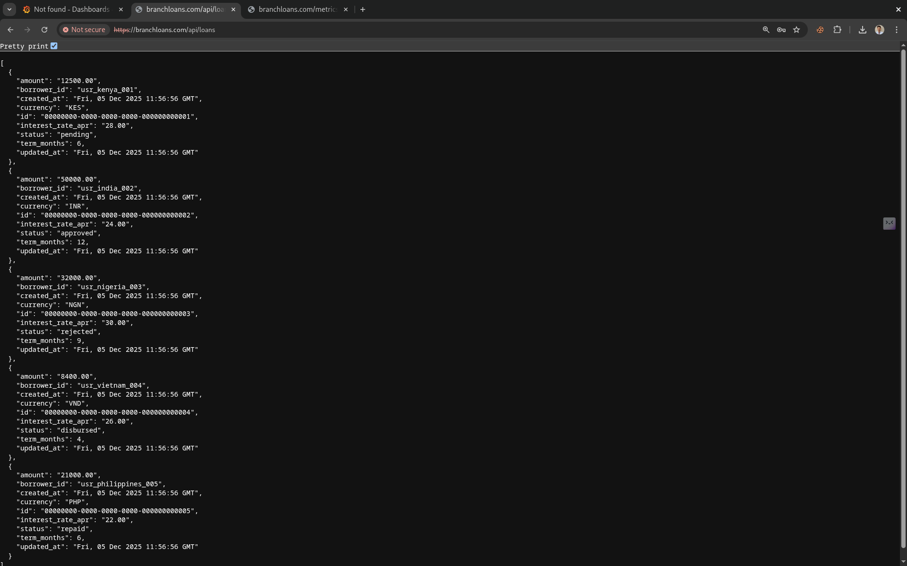
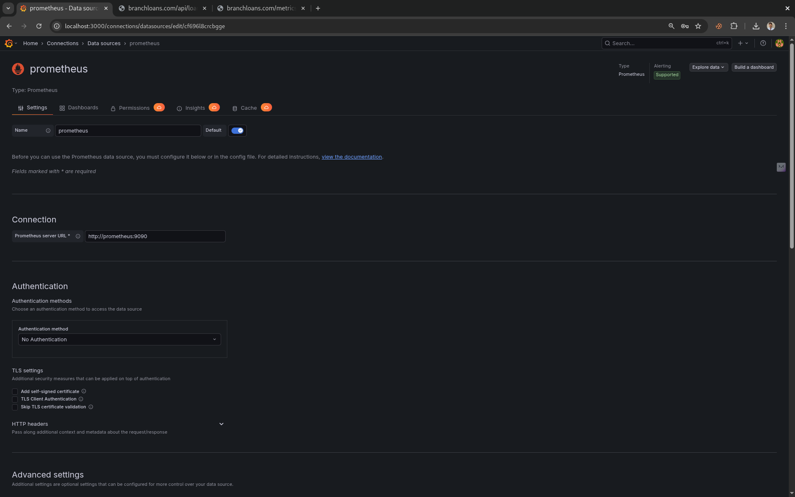
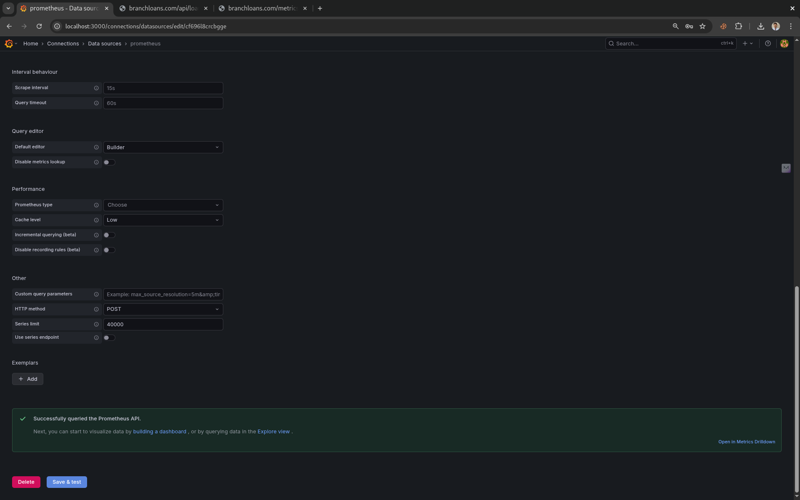
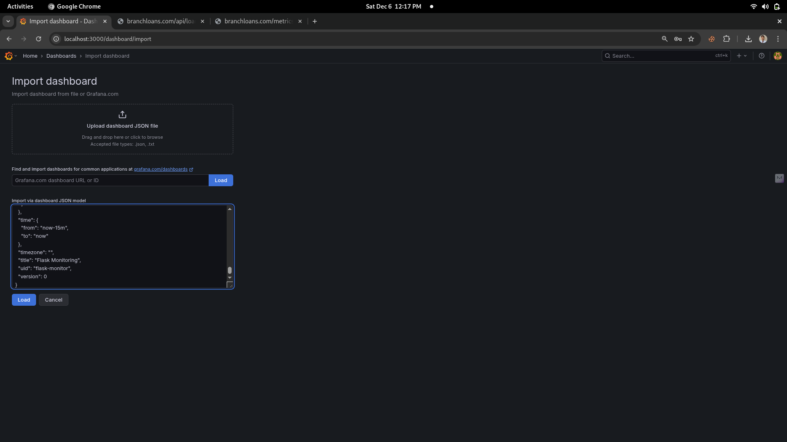
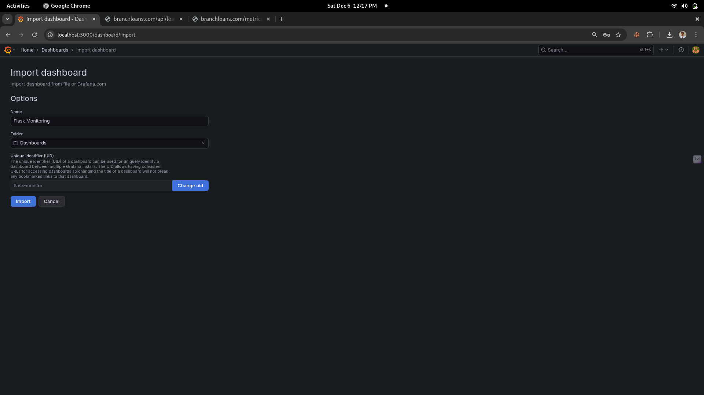
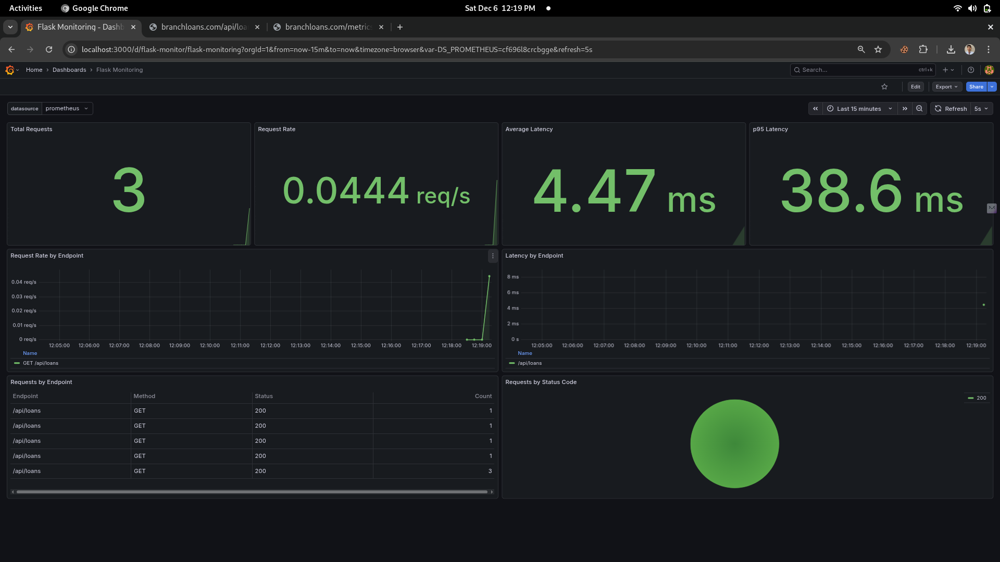

## Quick start Paste it For Grafana Dashboard as Import JSON Method

```bash
{
  "annotations": {
    "list": []
  },
  "editable": true,
  "fiscalYearStartMonth": 0,
  "graphTooltip": 0,
  "id": null,
  "links": [],
  "panels": [
    {
      "datasource": {
        "type": "prometheus",
        "uid": "${DS_PROMETHEUS}"
      },
      "fieldConfig": {
        "defaults": {
          "color": {
            "mode": "thresholds"
          },
          "mappings": [],
          "thresholds": {
            "mode": "absolute",
            "steps": [
              {
                "color": "green",
                "value": null
              }
            ]
          }
        }
      },
      "gridPos": {
        "h": 8,
        "w": 6,
        "x": 0,
        "y": 0
      },
      "id": 1,
      "options": {
        "colorMode": "value",
        "graphMode": "area",
        "reduceOptions": {
          "calcs": ["lastNotNull"]
        }
      },
      "targets": [
        {
          "datasource": {
            "type": "prometheus",
            "uid": "${DS_PROMETHEUS}"
          },
          "expr": "sum(request_count_total)",
          "refId": "A"
        }
      ],
      "title": "Total Requests",
      "type": "stat"
    },
    {
      "datasource": {
        "type": "prometheus",
        "uid": "${DS_PROMETHEUS}"
      },
      "fieldConfig": {
        "defaults": {
          "color": {
            "mode": "thresholds"
          },
          "mappings": [],
          "thresholds": {
            "mode": "absolute",
            "steps": [
              {
                "color": "green",
                "value": null
              }
            ]
          },
          "unit": "reqps"
        }
      },
      "gridPos": {
        "h": 8,
        "w": 6,
        "x": 6,
        "y": 0
      },
      "id": 2,
      "options": {
        "colorMode": "value",
        "graphMode": "area",
        "reduceOptions": {
          "calcs": ["lastNotNull"]
        }
      },
      "targets": [
        {
          "datasource": {
            "type": "prometheus",
            "uid": "${DS_PROMETHEUS}"
          },
          "expr": "sum(rate(request_count_total[1m]))",
          "refId": "A"
        }
      ],
      "title": "Request Rate",
      "type": "stat"
    },
    {
      "datasource": {
        "type": "prometheus",
        "uid": "${DS_PROMETHEUS}"
      },
      "fieldConfig": {
        "defaults": {
          "color": {
            "mode": "thresholds"
          },
          "mappings": [],
          "thresholds": {
            "mode": "absolute",
            "steps": [
              {
                "color": "green",
                "value": null
              }
            ]
          },
          "unit": "s"
        }
      },
      "gridPos": {
        "h": 8,
        "w": 6,
        "x": 12,
        "y": 0
      },
      "id": 3,
      "options": {
        "colorMode": "value",
        "graphMode": "area",
        "reduceOptions": {
          "calcs": ["lastNotNull"]
        }
      },
      "targets": [
        {
          "datasource": {
            "type": "prometheus",
            "uid": "${DS_PROMETHEUS}"
          },
          "expr": "rate(request_latency_seconds_sum[1m]) / rate(request_latency_seconds_count[1m])",
          "refId": "A"
        }
      ],
      "title": "Average Latency",
      "type": "stat"
    },
    {
      "datasource": {
        "type": "prometheus",
        "uid": "${DS_PROMETHEUS}"
      },
      "fieldConfig": {
        "defaults": {
          "color": {
            "mode": "thresholds"
          },
          "mappings": [],
          "thresholds": {
            "mode": "absolute",
            "steps": [
              {
                "color": "green",
                "value": null
              }
            ]
          },
          "unit": "s"
        }
      },
      "gridPos": {
        "h": 8,
        "w": 6,
        "x": 18,
        "y": 0
      },
      "id": 4,
      "options": {
        "colorMode": "value",
        "graphMode": "area",
        "reduceOptions": {
          "calcs": ["lastNotNull"]
        }
      },
      "targets": [
        {
          "datasource": {
            "type": "prometheus",
            "uid": "${DS_PROMETHEUS}"
          },
          "expr": "histogram_quantile(0.95, rate(request_latency_seconds_bucket[5m]))",
          "refId": "A"
        }
      ],
      "title": "p95 Latency",
      "type": "stat"
    },
    {
      "datasource": {
        "type": "prometheus",
        "uid": "${DS_PROMETHEUS}"
      },
      "fieldConfig": {
        "defaults": {
          "color": {
            "mode": "palette-classic"
          },
          "custom": {
            "axisPlacement": "auto",
            "drawStyle": "line",
            "fillOpacity": 10,
            "lineWidth": 2
          },
          "unit": "reqps"
        }
      },
      "gridPos": {
        "h": 8,
        "w": 12,
        "x": 0,
        "y": 8
      },
      "id": 5,
      "options": {
        "legend": {
          "displayMode": "table",
          "placement": "bottom"
        }
      },
      "targets": [
        {
          "datasource": {
            "type": "prometheus",
            "uid": "${DS_PROMETHEUS}"
          },
          "expr": "sum(rate(request_count_total[1m])) by (endpoint, method)",
          "legendFormat": "{{method}} {{endpoint}}",
          "refId": "A"
        }
      ],
      "title": "Request Rate by Endpoint",
      "type": "timeseries"
    },
    {
      "datasource": {
        "type": "prometheus",
        "uid": "${DS_PROMETHEUS}"
      },
      "fieldConfig": {
        "defaults": {
          "color": {
            "mode": "palette-classic"
          },
          "custom": {
            "axisPlacement": "auto",
            "drawStyle": "line",
            "fillOpacity": 10,
            "lineWidth": 2
          },
          "unit": "s"
        }
      },
      "gridPos": {
        "h": 8,
        "w": 12,
        "x": 12,
        "y": 8
      },
      "id": 6,
      "options": {
        "legend": {
          "displayMode": "table",
          "placement": "bottom"
        }
      },
      "targets": [
        {
          "datasource": {
            "type": "prometheus",
            "uid": "${DS_PROMETHEUS}"
          },
          "expr": "rate(request_latency_seconds_sum[1m]) / rate(request_latency_seconds_count[1m])",
          "legendFormat": "{{endpoint}}",
          "refId": "A"
        }
      ],
      "title": "Latency by Endpoint",
      "type": "timeseries"
    },
    {
      "datasource": {
        "type": "prometheus",
        "uid": "${DS_PROMETHEUS}"
      },
      "fieldConfig": {
        "defaults": {
          "custom": {
            "align": "auto"
          }
        }
      },
      "gridPos": {
        "h": 8,
        "w": 12,
        "x": 0,
        "y": 16
      },
      "id": 7,
      "options": {
        "showHeader": true
      },
      "targets": [
        {
          "datasource": {
            "type": "prometheus",
            "uid": "${DS_PROMETHEUS}"
          },
          "expr": "sum(request_count_total) by (endpoint, method, status)",
          "format": "table",
          "refId": "A"
        }
      ],
      "title": "Requests by Endpoint",
      "transformations": [
        {
          "id": "organize",
          "options": {
            "excludeByName": {
              "Time": true
            },
            "renameByName": {
              "Value": "Count",
              "endpoint": "Endpoint",
              "method": "Method",
              "status": "Status"
            }
          }
        }
      ],
      "type": "table"
    },
    {
      "datasource": {
        "type": "prometheus",
        "uid": "${DS_PROMETHEUS}"
      },
      "fieldConfig": {
        "defaults": {
          "color": {
            "mode": "palette-classic"
          }
        }
      },
      "gridPos": {
        "h": 8,
        "w": 12,
        "x": 12,
        "y": 16
      },
      "id": 8,
      "options": {
        "legend": {
          "displayMode": "table",
          "placement": "right"
        },
        "pieType": "pie"
      },
      "targets": [
        {
          "datasource": {
            "type": "prometheus",
            "uid": "${DS_PROMETHEUS}"
          },
          "expr": "sum(request_count_total) by (status)",
          "legendFormat": "{{status}}",
          "refId": "A"
        }
      ],
      "title": "Requests by Status Code",
      "type": "piechart"
    }
  ],
  "refresh": "5s",
  "schemaVersion": 38,
  "tags": [],
  "templating": {
    "list": [
      {
        "hide": 0,
        "label": "datasource",
        "name": "DS_PROMETHEUS",
        "query": "prometheus",
        "refresh": 1,
        "type": "datasource"
      }
    ]
  },
  "time": {
    "from": "now-15m",
    "to": "now"
  },
  "timezone": "",
  "title": "Flask Monitoring",
  "uid": "flask-monitor",
  "version": 0
}
```

## UI Screenshots

### api/loans data


### prometheus-datasource





### Grafana Import


### JSON


### Grafana Dasboard Name


### Dashboard
